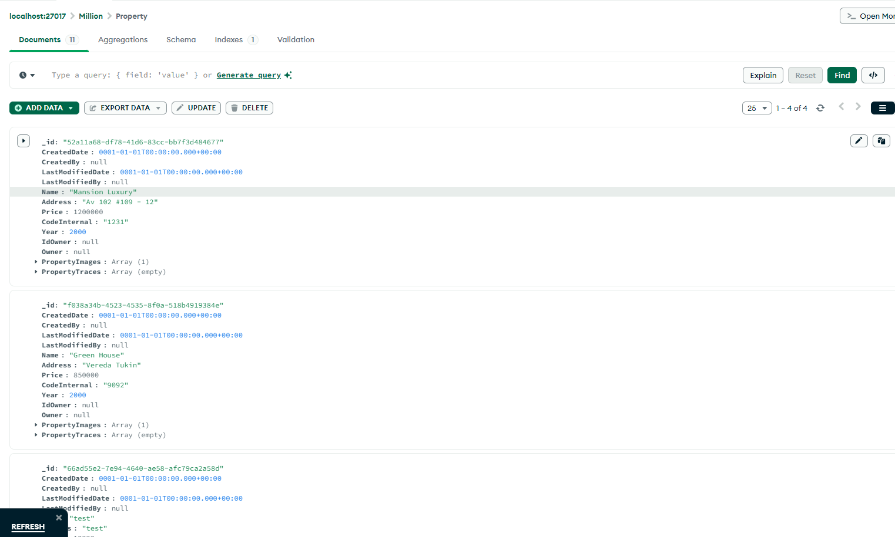

# Proyecto Fullstack: Next.js (Frontend) y .NET 8 API (Backend)

## Requisitos previos

### Herramientas necesarias:
- Node.js (recomendado v18 o superior)
- Next.js 15
- pnpm o yarn (gestor de paquetes para Node.js)
- .NET 8 SDK
- MongoDB
- Visual Studio Code o cualquier IDE de tu preferencia
- Git

---

## Instrucciones para levantar el proyecto

### 1. Frontend (Next.js)

#### Pasos:

1. **Clonar el repositorio**:
   ```bash
   git clone https://github.com/rafapin/Million
   cd Million.Frontend/million-client
   ```

2. **Instalar dependencias**:
   ```bash
   pnpm install
   # o si usas yarn:
   yarn install
   ```

3. **Configurar variables de entorno**:
   Crear un archivo `.env.local` en la raíz del proyecto frontend con las variables necesarias. Un ejemplo:
   ```env
   API_URL = "https://localhost:7187/"
   NEXT_PUBLIC_ENV=development
   ```

4. **Ejecutar el servidor de desarrollo**:
   ```bash
   pnpm run dev
   # o
   yarn dev
   ```

5. **Abrir la aplicación**:
   Ve a [http://localhost:3000](http://localhost:3000) para ver la aplicación corriendo.

---

### 2. Backend (.NET 8 API)

#### Pasos:

1. **Clonar el repositorio**:
   ```bash
   git clone https://github.com/rafapin/Million
   cd Million.Backend
   ```

2. **Configurar variables de entorno**:
   Crear un archivo `appsettings.Development.json` en la carpeta del proyecto con la configuración necesaria. Un ejemplo:
   ```json
   {
    "Logging": {
        "LogLevel": {
        "Default": "Information",
        "Microsoft.AspNetCore": "Warning"
        }
    },
    "MongoSettings": {
        "ConnectionString": "mongodb://localhost:27017",
        "DatabaseName": "Million"
    },
    "AllowedHosts": "*"
    }

   ```

3. **Ejecutar el proyecto**:
   En el IDE o desde la terminal:
   ```bash
   dotnet run
   ```

4. **API en ejecución**:
   Por defecto, el backend estará disponible en [http://localhost:5000](http://localhost:5000).

---

## Screenshots

   ### Frontend en ejecución
   
   
   
   ### Backend en ejecución
   
   
   

---

## Comandos útiles

### Frontend
- `pnpm run dev`: Levanta el servidor de desarrollo.
- `pnpm run build`: Genera la versión optimizada para producción.
- `pnpm start`: Sirve la aplicación en producción.

### Backend
- `dotnet build`: Compila la solución.
- `dotnet run`: Levanta la API.
- `dotnet test`: Ejecuta las pruebas unitarias.

---

¡Listo! Ahora deberías tener tu proyecto Fullstack corriendo con Next.js en el frontend y .NET 8 API en el backend.

